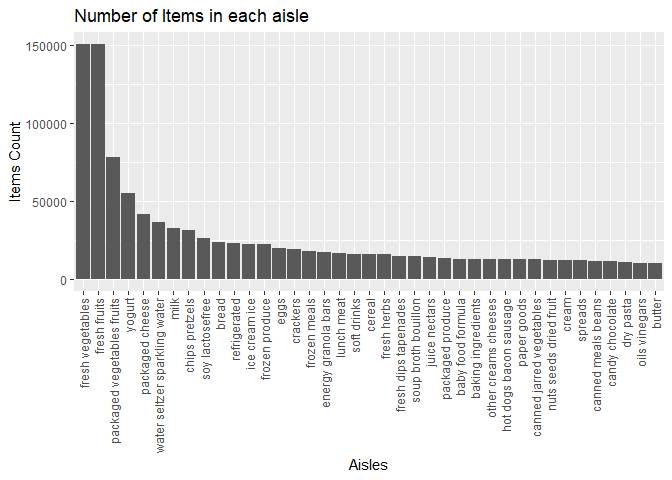
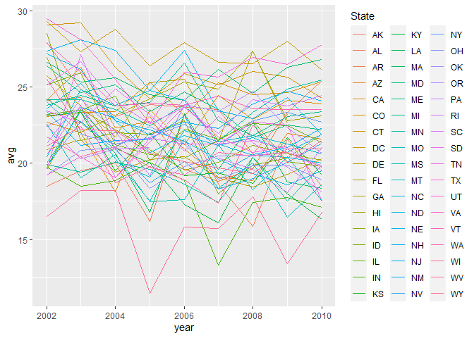
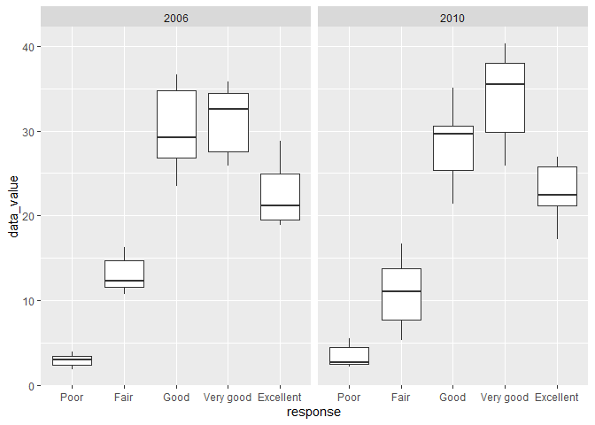

p8105\_hw3\_nz2333
================
nz2333
10/20/2021

``` r
library(tidyverse)
```

    ## -- Attaching packages --------------------------------------- tidyverse 1.3.1 --

    ## v ggplot2 3.3.5     v purrr   0.3.4
    ## v tibble  3.1.4     v dplyr   1.0.7
    ## v tidyr   1.1.3     v stringr 1.4.0
    ## v readr   2.0.1     v forcats 0.5.1

    ## -- Conflicts ------------------------------------------ tidyverse_conflicts() --
    ## x dplyr::filter() masks stats::filter()
    ## x dplyr::lag()    masks stats::lag()

``` r
library(p8105.datasets)
data("instacart")
```

# Problem 1

/The dataset instacart has 1384617 observations and 15 variables.
Important variables include: product\_name, aisle, and department, which
are all categorical variables./

\#Question1

``` r
aisles = instacart %>%
  count(aisle, sort = TRUE)

aisles
```

    ## # A tibble: 134 x 2
    ##    aisle                              n
    ##    <chr>                          <int>
    ##  1 fresh vegetables              150609
    ##  2 fresh fruits                  150473
    ##  3 packaged vegetables fruits     78493
    ##  4 yogurt                         55240
    ##  5 packaged cheese                41699
    ##  6 water seltzer sparkling water  36617
    ##  7 milk                           32644
    ##  8 chips pretzels                 31269
    ##  9 soy lactosefree                26240
    ## 10 bread                          23635
    ## # ... with 124 more rows

/There are total 134 aisles in the data. The aisle with most oredered
items is “fresh vegetables”, with 150609 items./

\#Question2

``` r
aisles2 = instacart %>%
  count(aisle, sort = TRUE)%>%
  filter(n > 10000)

ggplot(data = aisles2, aes(x = reorder(aisle, -n), y = n)) +
  geom_bar(stat = "identity") +
  theme(axis.text.x = element_text(angle = 90, vjust = 0.5, hjust=1))+
  labs(title = "Number of Items in each aisle") +
  xlab("Aisles") +
  ylab("Items Count")
```

<!-- -->

/There are 39 aisles with more than 10000 items ordered. Fresh
vegetables and fresh fruits are the top two aisles with highest ordered
items./

\#Question3

``` r
instacart %>%
  filter(aisle %in% c("baking ingredients", "dog food care", "packaged vegetables fruits")
  )%>%
  group_by(aisle, product_name)%>%
  summarize(
    item_num = n()
  )%>%
  mutate(
    item_rank = min_rank(-item_num)
  )%>%
  filter(item_rank < 4) %>%
  select(-item_rank) %>%
  knitr::kable()
```

    ## `summarise()` has grouped output by 'aisle'. You can override using the `.groups` argument.

| aisle                      | product\_name                                 | item\_num |
|:---------------------------|:----------------------------------------------|----------:|
| baking ingredients         | Cane Sugar                                    |       336 |
| baking ingredients         | Light Brown Sugar                             |       499 |
| baking ingredients         | Pure Baking Soda                              |       387 |
| dog food care              | Organix Chicken & Brown Rice Recipe           |        28 |
| dog food care              | Small Dog Biscuits                            |        26 |
| dog food care              | Snack Sticks Chicken & Rice Recipe Dog Treats |        30 |
| packaged vegetables fruits | Organic Baby Spinach                          |      9784 |
| packaged vegetables fruits | Organic Blueberries                           |      4966 |
| packaged vegetables fruits | Organic Raspberries                           |      5546 |

/For aisle “baking ingredients”: the three most popular items are cane
sugar, light brown sugar, and pure brown sugar.

For aisle “dog food care”:the three most popular items are Organix
Chicken & Brown Rice Recipe, Small Dog Biscuits, and Snack Sticks
Chicken & Rice Recipe Dog Treats.

For aisle “packaged vegetables fruits”: the three most popular items are
Organic Baby Spinach, Organic Blueberries, and Organic Raspberries./

\#Question4

``` r
aisle4 = instacart %>%
  filter(product_name %in% c("Pink Lady Apples", "Coffee Ice Cream"))%>%
  group_by(product_name, order_dow)%>%
  summarize(
    mean_hour = mean(order_hour_of_day)
  )%>%
  pivot_wider(names_from = order_dow, 
              values_from = mean_hour)
```

    ## `summarise()` has grouped output by 'product_name'. You can override using the `.groups` argument.

``` r
colnames(aisle4)= c(" ", "Sunday", "Monday", "Tuesday", "Wednesday", "Thursday", "Friday", "Saturday")

aisle4 %>%
  knitr::kable()
```

|                  |   Sunday |   Monday |  Tuesday | Wednesday | Thursday |   Friday | Saturday |
|:-----------------|---------:|---------:|---------:|----------:|---------:|---------:|---------:|
| Coffee Ice Cream | 13.77419 | 14.31579 | 15.38095 |  15.31818 | 15.21739 | 12.26316 | 13.83333 |
| Pink Lady Apples | 13.44118 | 11.36000 | 11.70213 |  14.25000 | 11.55172 | 12.78431 | 11.93750 |

/The mean hour of the day ordering Pink Lady Apples and Coffee Ice
Creamon on each day of the week is shown as above. Day of the week being
coded as 0 =Sunday, 1 = Monday, 2 = Tuesday, 3 = Wednesday, 4 = Thusday,
5 = Friday, 6 = Saturday. /

# Problem 2

``` r
data("brfss_smart2010")
```

*Data cleaning*

``` r
problem2 = brfss_smart2010 %>%
  janitor::clean_names()%>%
  rename(State = locationabbr,
         County = locationdesc) %>%
  filter(
    topic == "Overall Health", 
    response %in% c("Poor", "Fair", "Good", "Very good","Excellent")) %>%  
   distinct() %>% 
  mutate(
    response = factor(response, levels = c("Poor", "Fair", "Good", "Very good","Excellent"))
    )
```

\#Question1

``` r
q1_1 = problem2 %>%
  filter(year == 2002) %>%
  group_by(State, year) %>%
  summarize(
    location_num = n_distinct(County)
  ) %>%
  filter(location_num > 6)
```

    ## `summarise()` has grouped output by 'State'. You can override using the `.groups` argument.

``` r
q1_1
```

    ## # A tibble: 6 x 3
    ## # Groups:   State [6]
    ##   State  year location_num
    ##   <chr> <int>        <int>
    ## 1 CT     2002            7
    ## 2 FL     2002            7
    ## 3 MA     2002            8
    ## 4 NC     2002            7
    ## 5 NJ     2002            8
    ## 6 PA     2002           10

``` r
q1_2 = problem2 %>%
  filter(year == 2010) %>%
  group_by(State, year) %>%
  summarize(
    location_num = n_distinct(County)
  ) %>%
  filter(location_num > 6)
```

    ## `summarise()` has grouped output by 'State'. You can override using the `.groups` argument.

``` r
q1_2
```

    ## # A tibble: 14 x 3
    ## # Groups:   State [14]
    ##    State  year location_num
    ##    <chr> <int>        <int>
    ##  1 CA     2010           12
    ##  2 CO     2010            7
    ##  3 FL     2010           41
    ##  4 MA     2010            9
    ##  5 MD     2010           12
    ##  6 NC     2010           12
    ##  7 NE     2010           10
    ##  8 NJ     2010           19
    ##  9 NY     2010            9
    ## 10 OH     2010            8
    ## 11 PA     2010            7
    ## 12 SC     2010            7
    ## 13 TX     2010           16
    ## 14 WA     2010           10

/In 2002, the following states were observed at 7 or more locations: CT,
FL, MA, NC, NJ, and PA.

In 2010, the following states were observed at 7 or more locations: CA,
CO, FL, MA, MD, NC, NE, NJ, NY, OH, PA, SC, TX, and WA./

# Question2

``` r
q2 = problem2 %>%
  filter(response == "Excellent") %>%
  group_by(State, year) %>%
  summarize(avg = mean(data_value)) %>%
  select(year, State, avg)
```

    ## `summarise()` has grouped output by 'State'. You can override using the `.groups` argument.

``` r
q2 %>%
  ggplot(aes(x = year, y = avg, group = State, color = State))+
  geom_line()
```

    ## Warning: Removed 3 row(s) containing missing values (geom_path).

<!-- -->

/This is a plot of the average data\_value of each state over time
(year). /

# Question3

``` r
q3 = problem2 %>%
  filter(
    year %in% c("2006", "2010"),
    response %in% c("Poor", "Fair", "Good", "Very good","Excellent"), 
    State == "NY"
  ) %>%
  select(year, State, response, data_value) %>%
  drop_na()
  
q3 %>%
  ggplot(aes(x = response, y = data_value)) +
  geom_boxplot() +
  facet_grid(.~year)
```

<!-- -->

/These two graphs are for data value distributioof each reponse level
for year 2006 and 2010. /
